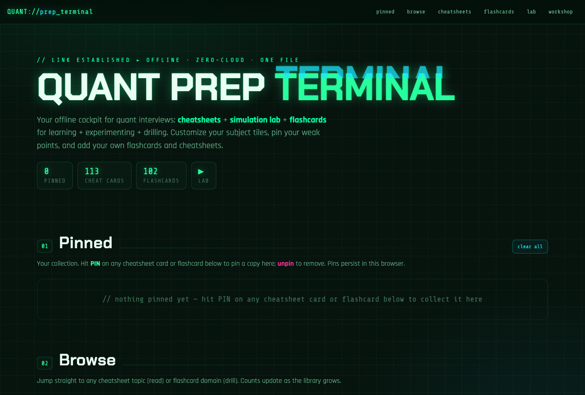
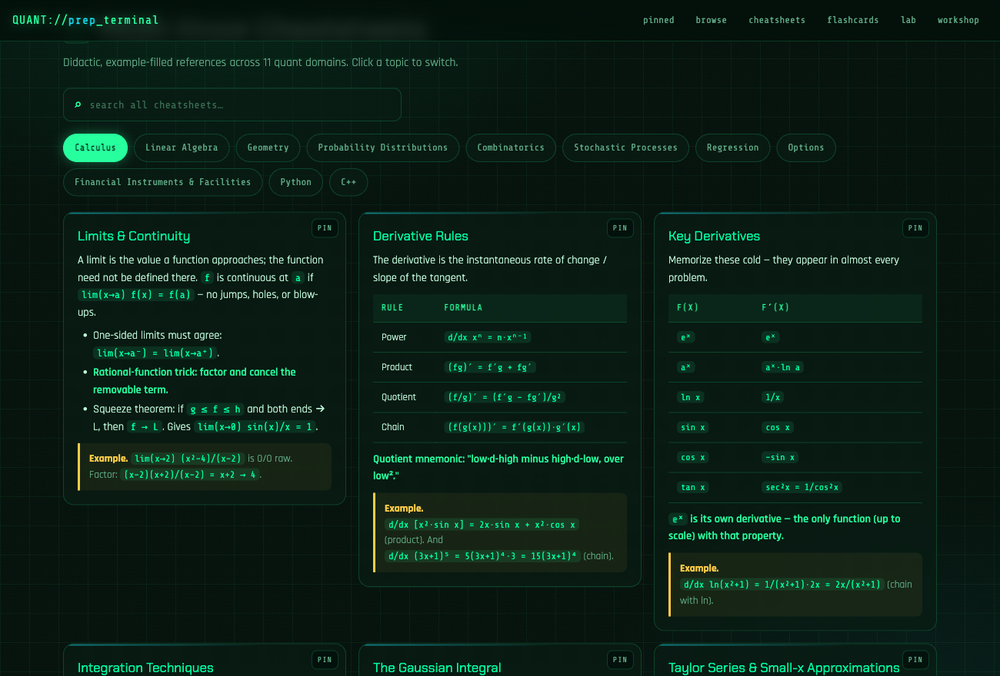
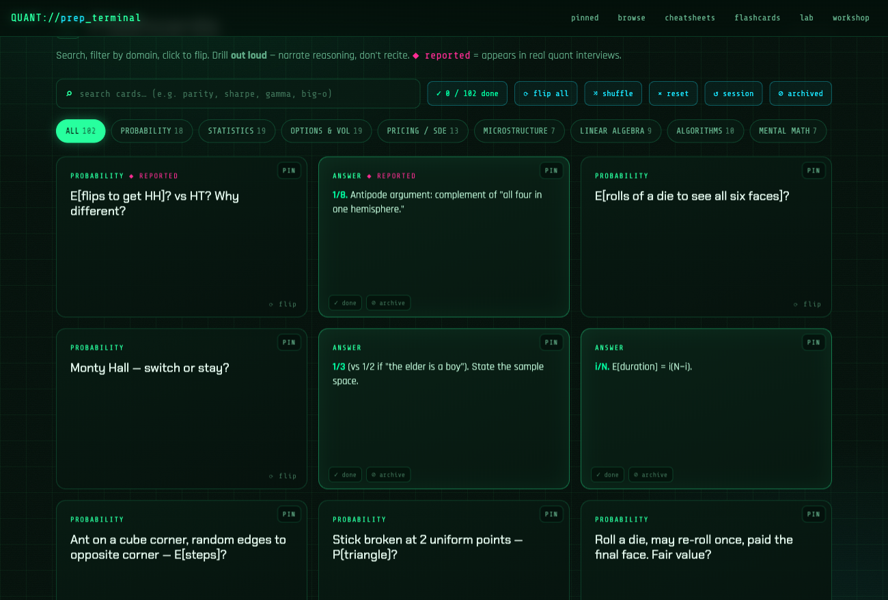
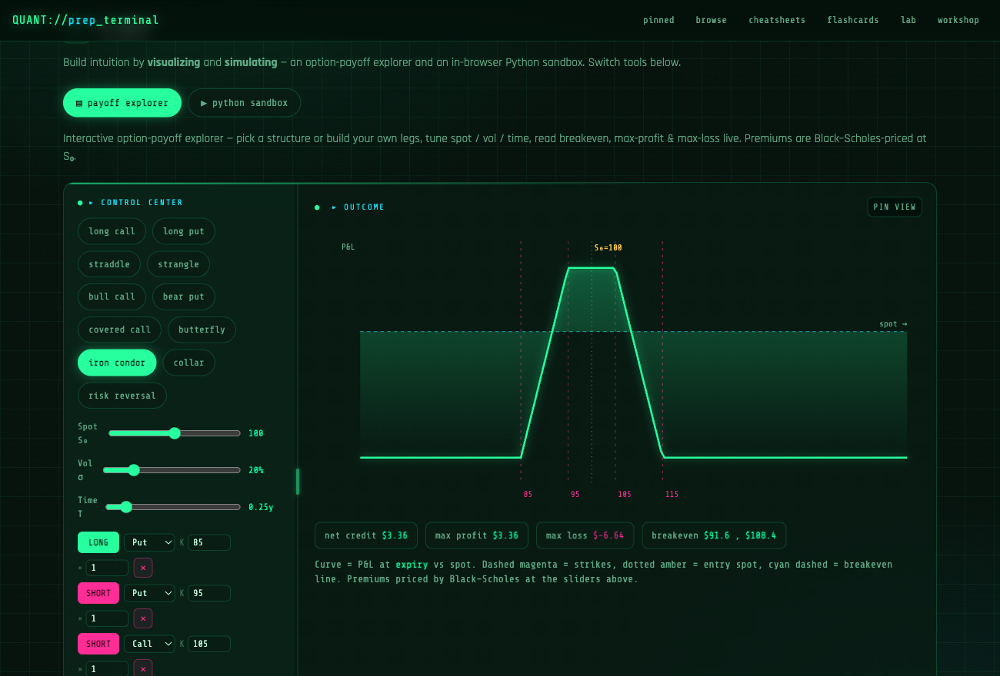

# 🟢 QUANT PREP TERMINAL

**Everything you need to cram for a quant interview, crammed into one HTML file.** Cheatsheets, flashcards, and a little lab where you can watch an iron condor lose money in real time. Free, no signup, and you can bend it to your will.

[**▶ Open the live app**](https://yuzh98.github.io/quant-prep-terminal/) · no install · runs in any browser · no, it won't email you

---

## Why this exists

Quant prep is its own unpaid part-time job. The knowledge lives in six different PDFs, two textbooks heavier than your student debt, and a flashcard app that wants $8/month to let you study your *own* notes.

So I put the whole loop — read it, drill it, simulate it, repeat until it sticks — in a single file you actually own. Open it, study, close it. Your cards, your pins, your progress all stay in your browser. No account. No subscription. No "we've updated our privacy policy" emails at 2am.

## What's inside

### Cheatsheets — for the formula you'll absolutely blank on
Eleven domains: calculus, linear algebra, geometry, probability distributions, combinatorics, stochastic processes, regression, options, financial instruments, Python, and C++. Bite-size cards with worked examples, because "I knew the formula, I just couldn't *recall* it under pressure" is not a thing you get to say in the actual interview. One search box covers all of them.

### Flashcards — flip, panic, flip back, pretend you knew it
100+ real interview questions. Search them, filter by topic, shuffle so you can't cheat by memorizing the order. Flip to check yourself, then **pin** the ones that humble you, **archive** the ones you've genuinely nailed, and mark cards **done** for the session so the pile visibly shrinks. (The dopamine is free too.)

### Lab — see it, simulate it, believe it
Build an option payoff leg by leg — Black–Scholes-priced, with a live breakeven, max profit/loss, and a P&L crosshair that chases your cursor. Or open the Python sandbox and run a *real* simulation in the browser. When the interviewer raises an eyebrow and says "you sure E[flips to get HH] is 6?", you can say "ran it 200,000 times, yeah." That's not arrogance. That's a confidence interval.

## How to use it

1. **Open** the [live app](https://yuzh98.github.io/quant-prep-terminal/) — or download `index.html` and double-click it like it's 2005.
2. **Browse** — click a subject tile, land on its cheatsheet or flashcards.
3. **Drill** — flip cards, mark *done* as you go, *pin* what burns you.
4. **Experiment** — drag the spot/vol/time sliders, build a position, or simulate something to settle a bet with yourself.
5. **Collect** — anything you pin shows up at the top, ready for the night-before panic review.

## Make it yours

It's *your* terminal, so the **Workshop** lets you:

- Add your own **subjects**, **flashcards**, and **cheatsheet cards** (the question that stumped you in the last round? Add it. Make it pay.)
- Archive, restore, or delete anything
- Everything auto-saves to your browser — no login, because the last thing you need is another password

Want to reskin it or gut it entirely? It's one readable HTML file. **Fork it, edit `index.html`, go nuts.**

### Prefer a clean slate?

If you'd rather build your *own* deck from scratch — no pre-loaded cheatsheets or flashcards getting in your way — open [**`blank.html`**](https://yuzh98.github.io/quant-prep-terminal/blank.html) ([live](https://yuzh98.github.io/quant-prep-terminal/blank.html)). Same terminal, same Lab, zero seed content. Everything you add in the Workshop is yours alone. It's generated from `index.html` by `build-blank.py`, so it never drifts from the real thing.

## Run it

Nothing to install — open `index.html` in any modern browser. The fonts and the Python runtime load from a CDN, so those bits want an internet connection; everything else works on a plane, in a bunker, or during the campus wifi outage right before your mock interview.

## More on the way

This is an early release, not the finished article. More cheatsheets, more flashcards, and more lab toys are coming — the whole thing is data-driven, so most of it shows up as new cards, not a new app. Check back, or ⭐ the repo to get nagged when it grows.

## License

Free for personal, non-commercial use under **CC BY-NC 4.0**. Study with it, share it, build on it — just give credit and don't sell my flashcards back to me. See [LICENSE](LICENSE).

---

*Built by someone who was also prepping for quant interviews. If it helps you land the offer, a ⭐ is a perfectly acceptable thank-you.*
